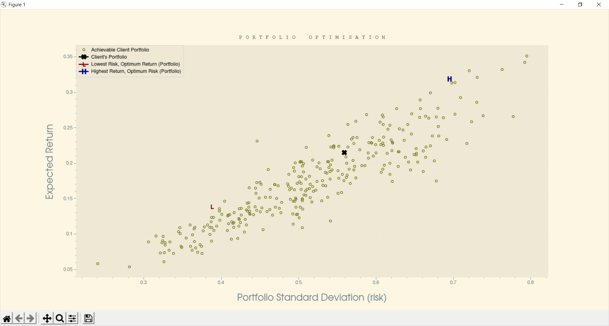
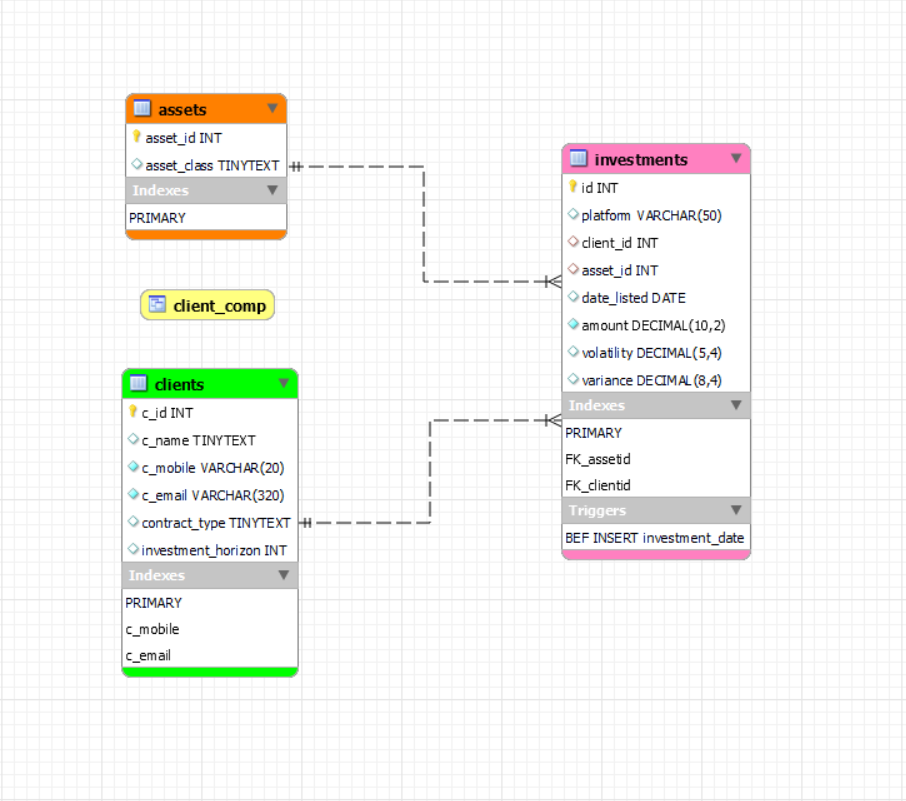
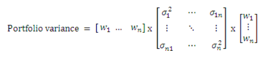

# Portfolios Manager


This system helps in building and managing 
a number of clients' investing portfolio. 
By analysing the 
current portfolio against
other portfolios to **optimise** it and achieve the 
strategy agreed upon with the client.
With respect to expected
_return, risk exposure, diversity and more._

## Illustration



## ER Model



_note that client_comp is a view_

# The Analysis



**Portfolio variance** is calculated by multiplying: 
1) Vector of weight of individual assets in portfolio of size (1 x 6)
2) Matrix of assets variances and every possible asset combination's covariance of size (number of assets x number of assets).
3) Vector of weight of individual assets in portfolio of size (6 x 1)

_The **standard deviation** of a portfolio is a measurement of risk and can be calculated by finding square root of portfolio variance._  

## Diversity

Diversity of portfolio is checked by testing against three benchmarks.
1) Volatility of Portfolio 
2) Number of asset classes
3) Number of investments


# Instructions
To get started, first clone this repo:
```bash
git clone https://github.com/yaqoah/portfolios-manager.git
cd portfolios-manager
```
Create and activate venv:
```bash
python3 -m venv venv
```
Install all requirements:
```bash
pip install -r requirements.txt
```
You can now run the code:
```bash
python manager.py
```
